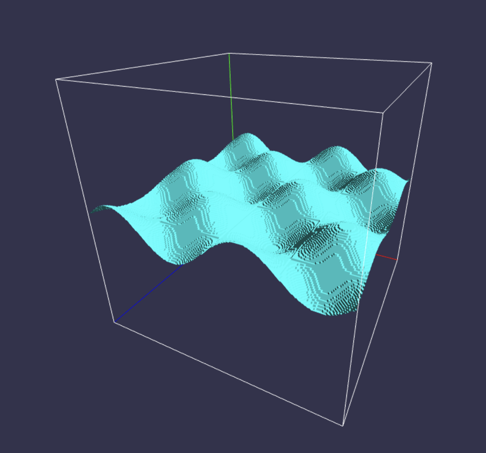
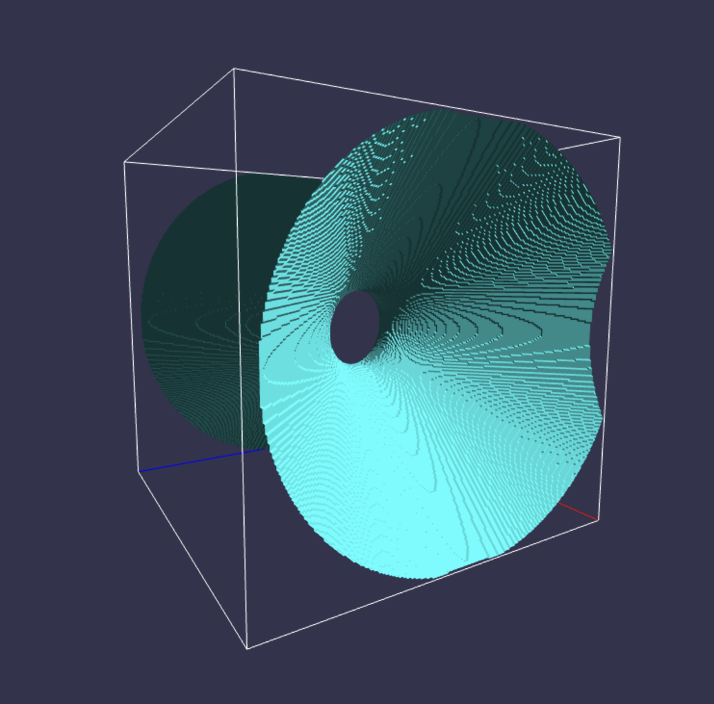

# Marching-Cubes

Marching Cubes is an algorithm used to create a three-dimensional surface mesh from a set of 3D points or a data set. The algorithm works by dividing the data into small cubes and evaluating a scalar function at each vertex of every cube. Based on the function values at the vertices and an isosurface value, the algorithm generates a surface for each cube. 

The language used for this project is C++ with the testing/programming done on an Ubuntu VM. To run the file in the vm, the following command was used:

**g++ MarchingCubes.cpp -lglew -lOpenGL -lGLFW**

**Please note that the required TriTable.hpp file must be in the same directory as the code to ensure that the program works as expected**

The program uses two 3D Scalar Field functions:

  
   
  <em>F1: y-sin(x)cos(z)</em>

  
   
  <em>F2: x^2 - y^2 - z^2 -z </em>

The function called "compute_normals"  takes two input arguments, a vector of floats representing positions of vertices in a 3D mesh and an output vector of floats representing the normals of each vertex in the mesh.Firstly, the output vector "normals" is cleared and resized to the same size as the "positions" vector. Then, for each group of three vertices, the positions of the three vertices are extracted and used to calculate the normal vector of the triangle using the cross product of two of its edges. The normals are then pushed into the vector of normals, with each value pushed in corresponding to the x,y,z positions from the vertices.

The function called "marching_cubes" takes in 5 input arguments, a 3D Scalar Field , floats for isoval, min, max, and stepsize. The function returns a vector of "vertices" which are essentially the positions for each triangle. The function begins with 3 for loops one for each one of the x,y,z components in our 3D space. We test the 8 corners of our cube and evaluate the value of the function given the x,y,z values with respect to each function. The cube configuration component helps us determine which of the 8 vertices of a cube are inside or outside of a given isosurface, based on whether their corresponding function values are greater than the isovalue or not. For each of the 8 vertices of the cube, the corresponding function value is checked against the isovalue using an "if" statement. If the function value is greater than the isovalue, the corresponding bit in the "which" variable is set to 1 using the bitwise OR operator  The bits in the "which" variable correspond to the vertices of the cube. The function then evaluates the contents of the lookup table and pushes the associated values into the vertices vector using a for loop. It is ensured that we only push in values that are above 0 as -1 means that there is nothing being drawn.

The render function takes in 5 input arguments, MVP Matrix, V Matrix, normals vector, vertices vector,light direction and an integer i. the function creates and binds buffers for the positions and normals based on the vectors. Then the VAO object is created to add the vertex attributes. The shader code is impleneted as specified with the phong-like shader with the LightDirection set at (5.0,5.0,5.0). The shader user 4 uniform variables in the shader program: MVP, V, LightDir, and modelColor. The object is drawn using glDrays(GL_TRIANGLES,0,i/3).

The writeply function accepts 3 input arguments, normal vector, position vector,and the string name for the plyfile. The function uses ofstream to create a file with the name and extention provided in the string. The header is then written into the output file following the standards of ply files. The positions and normals are written by looping over the position vector size and pushing in values from index 0-2 for both the positions and the normals.Similarly, for the face data we push in '3 i i+1 i+2 ' to specify that the faces don't share vertices. 

The camera controls specify r, phi, and theta with the initial view set at (5,5,5) looking at (0,0,0). 

Mouse_button_movements function: 

If the left mouse button is pressed down (GLFW_MOUSE_BUTTON_LEFT), and the action is a press (GLFW_PRESS), then the code gets the current mouse cursor position (glfwGetCursorPos()) and stores it in the last_xpos and last_ypos variables. It also sets the mouse_pressed boolean to true.

If the left mouse button is released (GLFW_MOUSE_BUTTON_LEFT) and the action is a release (GLFW_RELEASE), then the code sets the mouse_pressed boolean to false.

Mouse_button_movements function: 

The code updates the theta and phi angles based on the difference between the current mouse position (xpos and ypos) and the last recorded position (last_xpos and last_ypos). The theta angle is updated by the difference in the x position of the mouse, multiplied by 0.009f, which appears to be a scaling factor. The phi angle is updated by the negative difference in the y position of the mouse, multiplied by 0.009f and also inverted, which suggests that a downward motion of the mouse should increase phi.

The value of phi is clamped between 0.1 and 3.14-0.1 to ensure that our camera behaves correctly and does not flip unexpectedly.

key_movements function:

This function checks whether the up or down arrow key is being pressed. If the up arrow key is pressed, the variable r is decreased by camera_speed. If r becomes less than 0.1f, it is clamped to 0.1f. If the down arrow key is pressed, r is increased by camera_speed (0.25f)

Finally, the cameraControlsGlove function adjusts the camera based on the input of the user and converts the spherical coordinates of (r,theta,phi) to (x,y,z) cartesian coordinates. The function then adjusts the View matrix to reflect the changes.

The axes and the cube are drawn by calling the two respective functions with two parameters, min and max which are also used for the marching cubes algorithm. These two values specify a contraint on the 3d scalar field that we generate. 

Prior to the do loop in the main function, we populate normals and vertices vectors by calling the associated functions. The writeply function is also called after the data is retrived which creates a file in the same directory as the assignment file. The callback functions for mouse positions are also set.

In the do loop, we call the cameraControlsGlobe and the key_movements functions to continue adjusting the camera as per the user's needs. The render function is also called in the do loop to continue rendering with the growing mesh animation:

